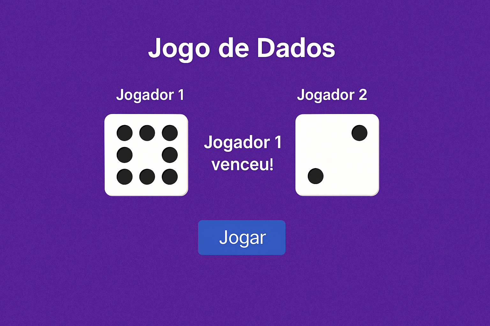

# 🎲 Jogo de Dados - ADS

Um jogo simples e divertido de dados feito com HTML, CSS e JavaScript. Ao clicar no botão **"Jogar"**, dois dados são lançados e o jogador com o maior número vence!

🔗 **Acesse o jogo online**: [Clique aqui para jogar](https://beatriz-oliveira-dev.github.io/jogo-dados-ads/)

## 🧠 Objetivo

Criar um projeto prático para fixar conceitos de:
- Manipulação do DOM
- Funções em JavaScript
- Geração de números aleatórios
- Animação e interatividade com eventos

## 🚀 Tecnologias

- HTML5  
- CSS3  
- JavaScript (Vanilla)

## 📸 Demonstração



> Caso a imagem acima não carregue, acesse diretamente o [site do jogo](https://beatriz-oliveira-dev.github.io/jogo-dados-ads/) para ver ao vivo.

## ⚙️ Como executar o projeto

Você pode jogar diretamente [aqui](https://beatriz-oliveira-dev.github.io/jogo-dados-ads/), sem precisar instalar nada.

Ou, se preferir rodar localmente:

```bash
# Clone o repositório
git clone https://github.com/Beatriz-Oliveira-Dev/jogo-dados-ads.git

# Acesse a pasta do projeto
cd jogo-dados-ads

# Abra o arquivo index.html no navegador
```

## 📁 Estrutura de pastas

```
jogo-dados-ads/
├── css/
│   └── estilo.css
├── imagens/
│   ├── dado1.png
│   ├── dado2.png
│   └── ...
├── js/
│   └── script.js
└── index.html
```

## ✨ Funcionalidades

- Lançamento aleatório de dois dados  
- Indicação visual do vencedor ou empate  
- Interface simples e responsiva

## 💡 Melhorias futuras

- Adicionar placar acumulado  
- Sons de rolagem de dados  
- Estilos personalizados por jogador

## 👩‍💻 Desenvolvido por

**Beatriz Oliveira**  
[LinkedIn](https://www.linkedin.com/in/beatrizlsoliveira/) | [GitHub](https://github.com/Beatriz-Oliveira-Dev)
